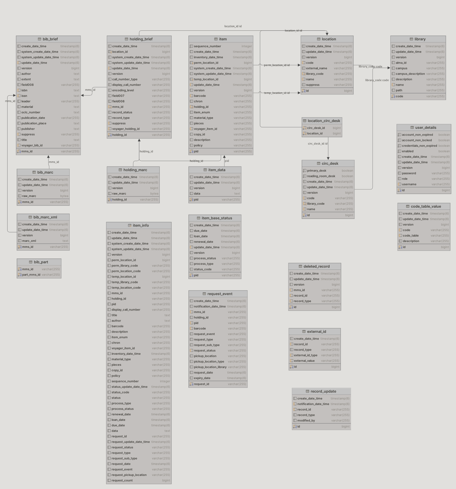
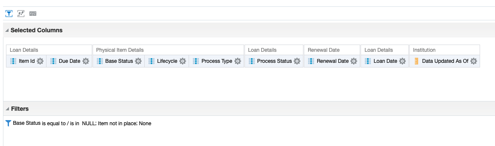

# Alma Publish to MARC

## Description
This is a Python-based system for processing Alma library system MARC records and importing them into a PostgreSQL database. It converts Alma Publish MARC records into separate bibliographic MARC, holding MARC, and item JSON records.

## Alma Publishing Profile
The script will process profiles which are published on the Bib level.

### Publishing Profile rules:
See pdf of publishing profile properties: [PDF](./doc/PublishingProfileDetails.pdf)

- Bibliographic system data is mapped to a BIB field
- Holding system data is mapped to a HLD field
- Items are mapped to ITM subfields
- All non-control holding fields are mapped to the same tag in the resulting record
- Holding control fields are mapped to unused control fields where possible

- Item subfields match `item-template.json`

## Quick Start
```
git clone git@github.com:yalelibrary/alma-publish-to-marc.git
python3 -m venv .venv
. ./.venv/bin/activate
pip3 install -r requirements.txt
```

## Required Environment Variables
```
# Required for all ingests
export DB_USERNAME=XXX
export DB_PASSWORD='XXX'
export DB_HOST=datasync-XXX
export DB_SCHEMA=datasync_tst

# Required for configuration ingests
export ALMA_API_TOKEN='XXX'
export ALMA_API_BASE_URL='https://api-na.hosted.exlibrisgroup.com/almaws/v1'
```

## Database Schema

### Schema Notes
- `item, holding_brief, bib_brief`: primary metadata records
- `holding_marc, bib_marc, bib_marc_xml`: marc records in binary format or xml. The marc XML records have enhancements from Alma, such as AVE fields with electronic information.
- `item_data`: contains json representation of items using Alma schema
- `item_info`: a _view_ of item data with location, status, holding, and bib data
- `location, library, circ_desk`: location, library, and circulation desk information
- `location_circ_desk`: many-to-many linking table between circulation desks and locations
- `deleted_record`: history of records deleted from the database
- `record_update`<sup>1</sup>: history of record updates by record_type and id populated by webhooks (currently only Items and Bibs are available)
- `item_base_status`<sup>1</sup>: up-to-date status information for items, populated by webhooks
- `request_event`<sup>1</sup>: request events, populated by webhooks
- `bib_part`: bound-with relationships between host bib record and parts
- `code_table_vaue`: lookup table containing code tables from Alma (currently BaseStatus and ItemPolicy)
- `external_id`: indexed table with external ids (currently isbn, issn, and oclc) When looking up records by external ids which may have multiple values, use this table rather than the corresponding field in bib_brief
- `user_details`: users with basic-authentication access to the datasync web app, used for programmatic access to datasync api

1: table updated by the webhook almost immediately after a record is edited in Alma

### Example Queries
```sql
select * from item_info where barcode = '39002085633130';
select * from item_info where mms_id = '9954061063408651';
select data::json#>'{holding_data, call_number_type, value}' from item_info where barcode = '39002085633130';
select * from location where library_code = 'sml';
select * from location where suppress = 'Y';
select * from circ_desk where library_code  = 'sml';
select encode(raw_marc, 'escape') from bib_marc where mms_id = '9954061063408651';
select holding_id from holding_brief where mms_id = '9954061063408651';
select status_code, status from item_info where barcode = '39002085633130';
select pid, barcode, status_code, status from item_info where mms_id = '9954061063408651';
select pid, barcode, display_call_number, copy_id, perm_location_code, temp_location_code, status_code, status from item_info where mms_id = '9954061063408651';
select xpath('/record/datafield[@tag = "AVE"]/subfield[@code = "o"]/text()', xmlparse(DOCUMENT marc_xml)) from bib_marc_xml where mms_id = '991010115506808651';
```
### Common Fields
- `create_date_time`: a timestamp of when the record was created in the datasync database
- `update_date_time`: a timestamp of when the record was updated in the datasync database
- `version`: an integer that increases each time a record is updated in the datasync database
- `id`: an auto incrementing id used in the datasync database as a unique key for tables which do not have one unique field in Alma


## Running the Ingest

### Incremental ingest from files on SFTP server
```
python3 alma_publish_to_database.py -k ~/.ssh/alma_prod_rsa --path alma-data/lit-publish -u alma_prod --wait-for-stable --delete -d /SML/Catalog/Solr/Alma/Published_Files/incremental-{datetime}/ --sftp
```

### Ingest from a directory without downloading from the SFTP server
```
python3 alma_publish_to_database.py -p /SML/Catalog/Solr/Alma/Published_Files/full_repository_bibliographic-20241218/
```

### Ingest from multiple directories (without downloading from the SFTP server)
```
python3 alma_publish_to_database.py -p '/SML/Catalog/Solr/Alma/Published_Files/incremental-202*/*'
```

### Ingest a full publish on the SFTP server with a database initialization
*WARNING* This will initialize the database by deleting all data and re-import the configuration using the API and the publish from the SFTP server
```
python3 alma_publish_to_database.py -k ~/.ssh/alma_prod_rsa --path alma-data/lit-publish -u alma_prod --wait-for-stable --delete -d /SML/Catalog/Solr/Alma/Published_Files/full-publish-{datetime}/ --sftp -c --initialize-database
```

### Ingest from a directory with database initialization
*WARNING* This will initialize the database by deleting all data and re-import the configuration using the API and the publish from a local directory
```
python3 alma_publish_to_database.py -c --initialize-database -p /SML/Catalog/Solr/Alma/Published_Files/full_repository_bibliographic-20241218/
```


## Adding Users to The Database
Readonly users can be created using the `utilities/db/add_readonly_user.py` script.
### Set up the environment for the db scripts if you have not already
```bash
cd utilities/db
python3 -m venv .venv
. ./.venv/bin/activate
pip install -r requirements.txt
```
### Running the script
The script needs access to the AWS Secrets store. It will look for credentials using `~/.aws`. It uses AWS to access the secret store to log into the database to create the user and give it the permissions.

This is an example to create a user called `datasync_prd_ro_new_user`. It will generate a random password, create the user, and store the username and password in `datasync/prd/database/app/ro_new_user`
```bash
cd utilities/db
. ./.venv/bin/activate
python add_readonly_user.py --secret-id=datasync/prd/database --app-secret-id datasync/prd/database/app --ro_user new_user
```
The app will print out the login information after it runs.


## Alma Item Status from an Analytics Report
After an initial import, the Item Status, Process, and Loan information can be updated by importing an analytics report tab-separated file.

### Analytics Configuration:
Export the following analytics report to a Tab-Separated-File: <br />


Import the file with:
```
python alma_analytics_to_item_status.py -f ItemStatusInformation.csv
```
